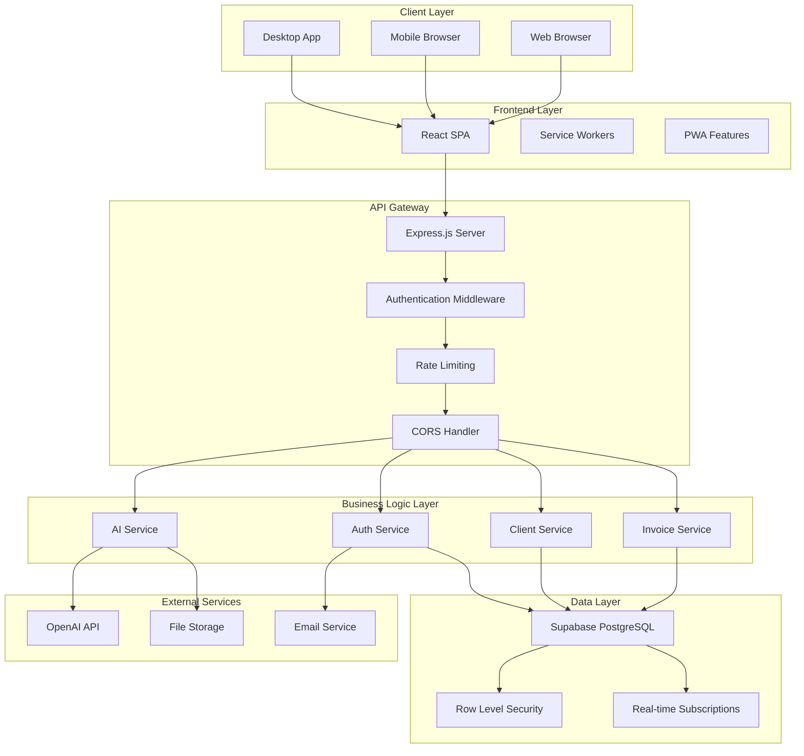
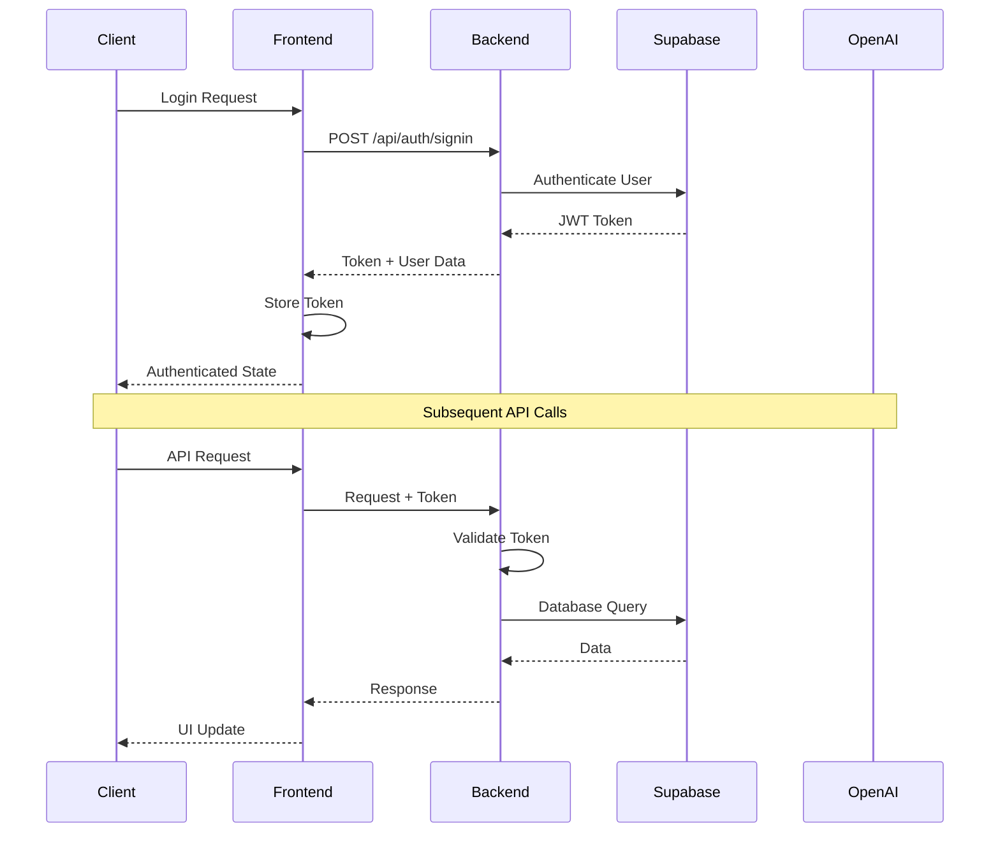
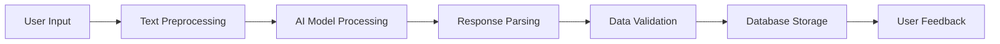

# 🏗️ Architecture Documentation

## System Overview

The AI Invoice Generator follows a modern, scalable architecture pattern that separates concerns between the frontend, backend, and database layers. The system is designed for high performance, security, and maintainability.

**Note**: This is a private project. The source code is not publicly available, but this documentation is provided for reference and understanding of the system architecture.

## High-Level Architecture



## Frontend Architecture

### Component Structure

```
src/
├── components/           # Reusable UI components
│   ├── Header.jsx       # Application header
│   ├── SideNav.jsx      # Navigation sidebar
│   ├── Login.jsx        # Authentication form
│   ├── ProgressBar.jsx  # Progress indicators
│   └── ProtectedRoute.jsx # Route protection
├── pages/               # Page-level components
│   ├── Dashboard.jsx    # Main dashboard
│   ├── Invoices.jsx     # Invoice management
│   ├── Clients.jsx      # Client management
│   ├── Settings.jsx     # User settings
│   └── InvoiceProgress/ # Invoice workflow
│       ├── InvoiceEditor.jsx
│       └── InvoiceExport.jsx
├── context/             # React Context providers
│   └── AuthContext.jsx  # Authentication state
├── services/            # API service layers
│   ├── authService.js   # Authentication API
│   ├── clientService.js # Client management API
│   ├── invoiceService.js # Invoice API
│   └── settingsService.js # Settings API
└── styles/              # Global styles
    └── layout.css       # Layout styles
```

### State Management

The application uses React Context for global state management:

- **AuthContext**: Manages user authentication state
- **Local State**: Component-level state with useState/useReducer
- **Service Layer**: Centralized API communication

### Routing Strategy

```javascript
// Route Structure
/                    # Dashboard (protected)
/login              # Authentication
/invoices           # Invoice list (protected)
/invoice-editor     # Create/edit invoice (protected)
/invoice-export     # Export functionality (protected)
/clients            # Client management (protected)
/settings           # User settings (protected)
/invoice/:id        # Invoice detail view (protected)
```

## Backend Architecture

### API Structure

```
root/
├── routes/              # Express route handlers
│   ├── auth.js         # Authentication endpoints
│   ├── clients.js      # Client management
│   └── invoices.js     # Invoice operations
├── services/           # Business logic services
│   ├── auth.js         # Authentication service
│   └── database.js     # Database operations
├── config/             # Configuration files
│   └── supabase.js     # Database configuration
├── database/           # Database schema
│   └── schema.sql      # SQL schema definition
└── script.js           # Main server entry point
```

### Service Layer Pattern

Each service follows a consistent pattern:

```javascript
// Service Structure Example
class InvoiceService {
  // Create new invoice
  async createInvoice(data) { }
  
  // Get invoice by ID
  async getInvoice(id) { }
  
  // Update invoice
  async updateInvoice(id, data) { }
  
  // Delete invoice
  async deleteInvoice(id) { }
  
  // List invoices with filters
  async listInvoices(filters) { }
}
```

### Middleware Stack

```javascript
// Express Middleware Chain
app.use(cors());                    // CORS handling
app.use(express.json());           // JSON parsing
app.use(rateLimit());              // Rate limiting
app.use(authMiddleware);           // Authentication
app.use('/api', routes);           // API routes
app.use(errorHandler);             // Error handling
```

## Database Architecture

### Schema Design

The database follows a normalized design with proper relationships:

```sql
-- Core Tables
users (id, email, name, business_name, ...)
clients (id, user_id, name, company, ...)
invoices (id, user_id, client_id, invoice_number, ...)
invoice_items (id, invoice_id, description, quantity, ...)
```

### Row Level Security (RLS)

Every table implements RLS policies:

```sql
-- Example RLS Policy
CREATE POLICY "Users can view own invoices" ON invoices
    FOR SELECT USING (user_id::text = auth.uid()::text);
```

### Indexing Strategy

```sql
-- Performance Indexes
CREATE INDEX idx_invoices_user_id ON invoices(user_id);
CREATE INDEX idx_invoices_status ON invoices(status);
CREATE INDEX idx_invoices_date ON invoices(invoice_date);
CREATE INDEX idx_clients_user_id ON clients(user_id);
```

## Security Architecture

### Authentication Flow



### Security Layers

1. **Transport Security**: HTTPS/TLS encryption
2. **Authentication**: JWT token validation
3. **Authorization**: Role-based access control
4. **Data Security**: Row-level security policies
5. **Input Validation**: Request sanitization
6. **Rate Limiting**: API abuse prevention

## AI Integration Architecture

### OpenAI Integration

```javascript
// AI Service Architecture
class AIService {
  async parseInvoiceText(text) {
    const prompt = this.buildPrompt(text);
    const response = await openai.chat.completions.create({
      model: "gpt-4",
      messages: [{ role: "user", content: prompt }],
      temperature: 0.1
    });
    return this.parseResponse(response);
  }
  
  async generateInvoiceContent(data) {
    // AI-powered content generation
  }
  
  async validateInvoiceData(data) {
    // AI-powered data validation
  }
}
```

### AI Processing Pipeline



## Performance Considerations

### Frontend Optimization

- **Code Splitting**: Lazy loading of components
- **Bundle Optimization**: Tree shaking and minification
- **Caching Strategy**: Service worker implementation
- **Image Optimization**: Responsive images and lazy loading

### Backend Optimization

- **Database Indexing**: Optimized query performance
- **Connection Pooling**: Efficient database connections
- **Caching**: Redis for frequently accessed data
- **Rate Limiting**: API abuse prevention

### Scalability Patterns

- **Horizontal Scaling**: Stateless backend design
- **Database Scaling**: Read replicas and partitioning
- **CDN Integration**: Static asset delivery
- **Microservices**: Service decomposition strategy

## Monitoring and Observability

### Logging Strategy

```javascript
// Structured Logging
const logger = {
  info: (message, meta) => console.log(JSON.stringify({
    level: 'info',
    message,
    timestamp: new Date().toISOString(),
    ...meta
  })),
  error: (message, error, meta) => console.error(JSON.stringify({
    level: 'error',
    message,
    error: error.stack,
    timestamp: new Date().toISOString(),
    ...meta
  }))
};
```

### Metrics Collection

- **Application Metrics**: Response times, error rates
- **Business Metrics**: User activity, invoice processing
- **Infrastructure Metrics**: CPU, memory, database performance
- **Security Metrics**: Authentication failures, suspicious activity

## Deployment Architecture

### Development Environment

```yaml
# Development Stack
Frontend: Vite Dev Server (localhost:5173)
Backend: Node.js Express (localhost:3000)
Database: Supabase (Cloud)
AI: OpenAI API (Cloud)
```

### Production Environment

```yaml
# Production Stack
Frontend: Vercel/Netlify (CDN)
Backend: Railway/Heroku (Container)
Database: Supabase (Managed PostgreSQL)
AI: OpenAI API (Cloud)
Storage: Supabase Storage (Cloud)
```

## Future Architecture Considerations

### Planned Enhancements

1. **Microservices Migration**: Service decomposition
2. **Event-Driven Architecture**: Async processing
3. **Machine Learning Pipeline**: Custom AI models
4. **Multi-tenancy**: Enterprise features
5. **Real-time Collaboration**: WebSocket integration

### Scalability Roadmap

- **Phase 1**: Current monolithic architecture
- **Phase 2**: Service extraction and API gateway
- **Phase 3**: Event-driven microservices
- **Phase 4**: Multi-region deployment

## Technology Decisions

### Why These Technologies?

**Frontend: React**
- Component-based architecture
- Large ecosystem and community
- Excellent developer experience
- Strong performance characteristics

**Backend: Node.js + Express**
- JavaScript consistency across stack
- Fast development cycle
- Rich npm ecosystem
- Excellent async capabilities

**Database: Supabase + PostgreSQL**
- Managed database service
- Built-in authentication
- Real-time capabilities
- Row-level security

**AI: OpenAI API**
- State-of-the-art language models
- Easy integration
- Reliable service
- Cost-effective scaling

This architecture provides a solid foundation for the AI Invoice Generator while maintaining flexibility for future enhancements and scaling requirements.
