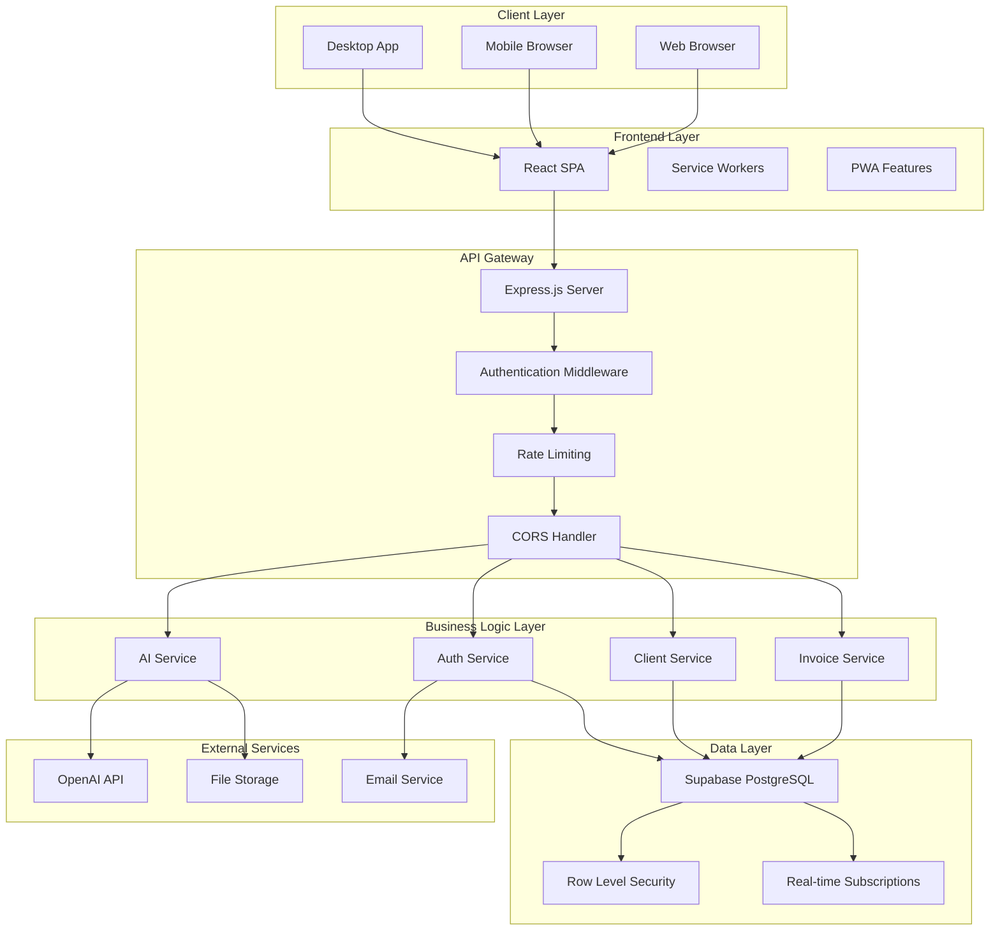
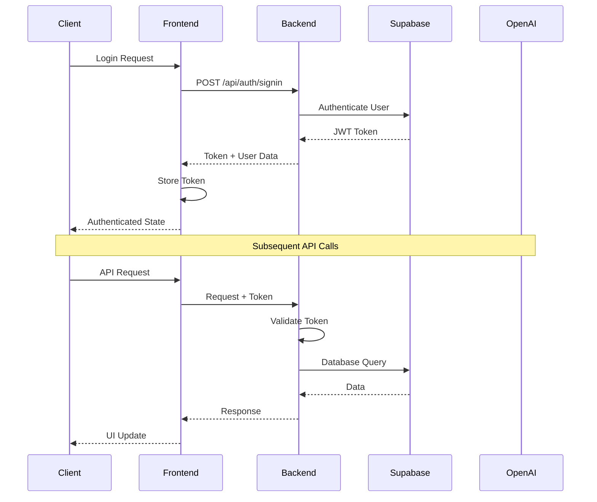
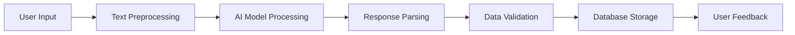

# 🏗️ Architecture Documentation

## System Overview

The AI Invoice Generator follows a modern, scalable architecture pattern that separates concerns between the frontend, backend, and database layers. The system is designed for high performance, security, and maintainability.

## High-Level Architecture


```mermaid
graph TB
    subgraph "Client Layer"
        A[Web Browser]
        B[Mobile Browser]
        C[Desktop App]
    end
    
    subgraph "Frontend Layer"
        D[React SPA]
        E[Service Workers]
        F[PWA Features]
    end
    
    subgraph "API Gateway"
        G[Express.js Server]
        H[Authentication Middleware]
        I[Rate Limiting]
        J[CORS Handler]
    end
    
    subgraph "Business Logic Layer"
        K[Invoice Service]
        L[Client Service]
        M[AI Service]
        N[Auth Service]
    end
    
    subgraph "Data Layer"
        O[Supabase PostgreSQL]
        P[Row Level Security]
        Q[Real-time Subscriptions]
    end
    
    subgraph "External Services"
        R[OpenAI API]
        S[File Storage]
        T[Email Service]
    end
    
    A --> D
    B --> D
    C --> D
    D --> G
    G --> H
    H --> I
    I --> J
    J --> K
    J --> L
    J --> M
    J --> N
    K --> O
    L --> O
    M --> R
    N --> O
    O --> P
    O --> Q
    M --> S
    N --> T
```

## Frontend Architecture

### Component Structure

```
src/
├── components/           # Reusable UI components
│   ├── Header.jsx       # Application header
│   ├── SideNav.jsx      # Navigation sidebar
│   ├── Login.jsx        # Authentication form
│   ├── ProgressBar.jsx  # Progress indicators
│   └── ProtectedRoute.jsx # Route protection
├── pages/               # Page-level components
│   ├── Dashboard.jsx    # Main dashboard
│   ├── Invoices.jsx     # Invoice management
│   ├── Clients.jsx      # Client management
│   ├── Settings.jsx     # User settings
│   └── InvoiceProgress/ # Invoice workflow
│       ├── InvoiceEditor.jsx
│       └── InvoiceExport.jsx
├── context/             # React Context providers
│   └── AuthContext.jsx  # Authentication state
├── services/            # API service layers
│   ├── authService.js   # Authentication API
│   ├── clientService.js # Client management API
│   ├── invoiceService.js # Invoice API
│   └── settingsService.js # Settings API
└── styles/              # Global styles
    └── layout.css       # Layout styles
```

### State Management

The application uses React Context for global state management:

- **AuthContext**: Manages user authentication state
- **Local State**: Component-level state with useState/useReducer
- **Service Layer**: Centralized API communication

### Routing Strategy

```javascript
// Route Structure
/                    # Dashboard (protected)
/login              # Authentication
/invoices           # Invoice list (protected)
/invoice-editor     # Create/edit invoice (protected)
/invoice-export     # Export functionality (protected)
/clients            # Client management (protected)
/settings           # User settings (protected)
/invoice/:id        # Invoice detail view (protected)
```

## Backend Architecture

### API Structure

```
root/
├── routes/              # Express route handlers
│   ├── auth.js         # Authentication endpoints
│   ├── clients.js      # Client management
│   └── invoices.js     # Invoice operations
├── services/           # Business logic services
│   ├── auth.js         # Authentication service
│   └── database.js     # Database operations
├── config/             # Configuration files
│   └── supabase.js     # Database configuration
├── database/           # Database schema
│   └── schema.sql      # SQL schema definition
└── script.js           # Main server entry point
```

### Service Layer Pattern

Each service follows a consistent pattern:

```javascript
// Service Structure Example
class InvoiceService {
  // Create new invoice
  async createInvoice(data) { }
  
  // Get invoice by ID
  async getInvoice(id) { }
  
  // Update invoice
  async updateInvoice(id, data) { }
  
  // Delete invoice
  async deleteInvoice(id) { }
  
  // List invoices with filters
  async listInvoices(filters) { }
}
```

### Middleware Stack

```javascript
// Express Middleware Chain
app.use(cors());                    // CORS handling
app.use(express.json());           // JSON parsing
app.use(rateLimit());              // Rate limiting
app.use(authMiddleware);           // Authentication
app.use('/api', routes);           // API routes
app.use(errorHandler);             // Error handling
```

## Database Architecture

### Schema Design

The database follows a normalized design with proper relationships:

```sql
-- Core Tables
users (id, email, name, business_name, ...)
clients (id, user_id, name, company, ...)
invoices (id, user_id, client_id, invoice_number, ...)
invoice_items (id, invoice_id, description, quantity, ...)
```

### Row Level Security (RLS)

Every table implements RLS policies:

```sql
-- Example RLS Policy
CREATE POLICY "Users can view own invoices" ON invoices
    FOR SELECT USING (user_id::text = auth.uid()::text);
```

### Indexing Strategy

```sql
-- Performance Indexes
CREATE INDEX idx_invoices_user_id ON invoices(user_id);
CREATE INDEX idx_invoices_status ON invoices(status);
CREATE INDEX idx_invoices_date ON invoices(invoice_date);
CREATE INDEX idx_clients_user_id ON clients(user_id);
```

## Security Architecture

### Authentication Flow


```mermaid
sequenceDiagram
    participant C as Client
    participant F as Frontend
    participant B as Backend
    participant S as Supabase
    participant O as OpenAI
    
    C->>F: Login Request
    F->>B: POST /api/auth/signin
    B->>S: Authenticate User
    S-->>B: JWT Token
    B-->>F: Token + User Data
    F->>F: Store Token
    F-->>C: Authenticated State
    
    Note over C,O: Subsequent API Calls
    C->>F: API Request
    F->>B: Request + Token
    B->>B: Validate Token
    B->>S: Database Query
    S-->>B: Data
    B-->>F: Response
    F-->>C: UI Update
```

### Security Layers

1. **Transport Security**: HTTPS/TLS encryption
2. **Authentication**: JWT token validation
3. **Authorization**: Role-based access control
4. **Data Security**: Row-level security policies
5. **Input Validation**: Request sanitization
6. **Rate Limiting**: API abuse prevention

## AI Integration Architecture

### OpenAI Integration

```javascript
// AI Service Architecture
class AIService {
  async parseInvoiceText(text) {
    const prompt = this.buildPrompt(text);
    const response = await openai.chat.completions.create({
      model: "gpt-4",
      messages: [{ role: "user", content: prompt }],
      temperature: 0.1
    });
    return this.parseResponse(response);
  }
  
  async generateInvoiceContent(data) {
    // AI-powered content generation
  }
  
  async validateInvoiceData(data) {
    // AI-powered data validation
  }
}
```

### AI Processing Pipeline


```mermaid
graph LR
    A[User Input] --> B[Text Preprocessing]
    B --> C[AI Model Processing]
    C --> D[Response Parsing]
    D --> E[Data Validation]
    E --> F[Database Storage]
    F --> G[User Feedback]
```

## Performance Considerations

### Frontend Optimization

- **Code Splitting**: Lazy loading of components
- **Bundle Optimization**: Tree shaking and minification
- **Caching Strategy**: Service worker implementation
- **Image Optimization**: Responsive images and lazy loading

### Backend Optimization

- **Database Indexing**: Optimized query performance
- **Connection Pooling**: Efficient database connections
- **Caching**: Redis for frequently accessed data
- **Rate Limiting**: API abuse prevention

### Scalability Patterns

- **Horizontal Scaling**: Stateless backend design
- **Database Scaling**: Read replicas and partitioning
- **CDN Integration**: Static asset delivery
- **Microservices**: Service decomposition strategy

## Monitoring and Observability

### Logging Strategy

```javascript
// Structured Logging
const logger = {
  info: (message, meta) => console.log(JSON.stringify({
    level: 'info',
    message,
    timestamp: new Date().toISOString(),
    ...meta
  })),
  error: (message, error, meta) => console.error(JSON.stringify({
    level: 'error',
    message,
    error: error.stack,
    timestamp: new Date().toISOString(),
    ...meta
  }))
};
```
